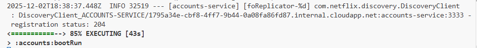
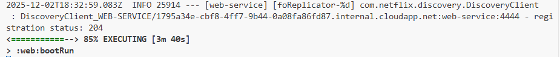
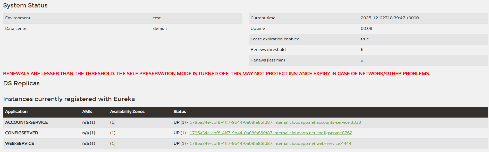
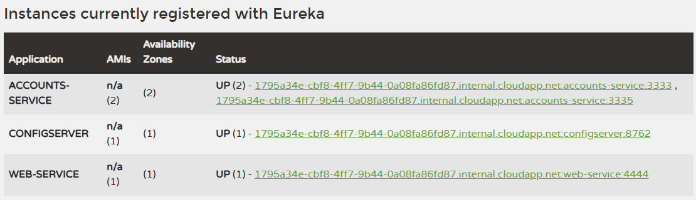
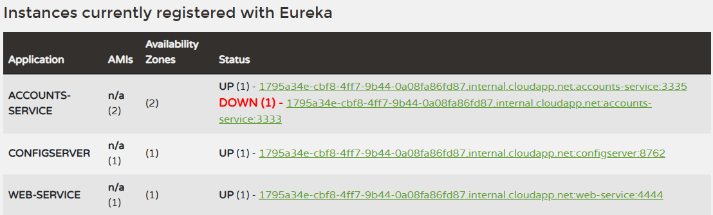
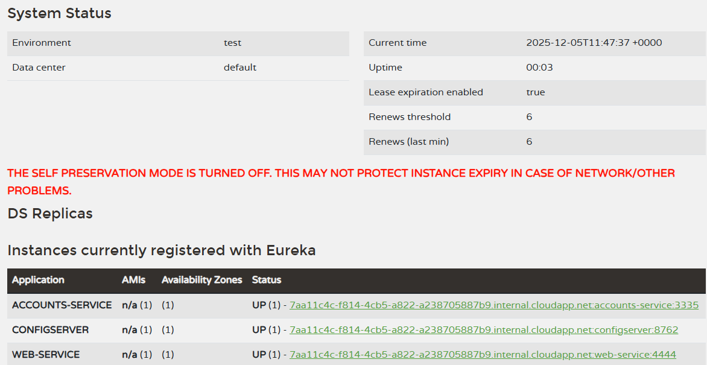
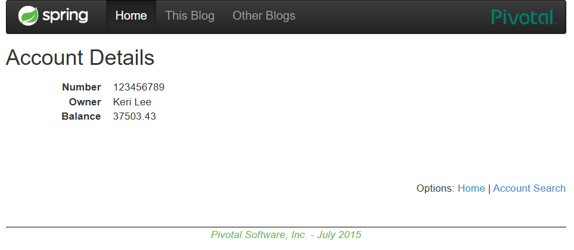

# Lab 6 Microservices - Project Report

## 1. Configuration Setup

**Configuration Repository**: 
[Link to my repository](https://github.com/LuciaMoralesRosa/lab6-microservices_LuciaMoralesRosa.git)

**Describe the changes you made to the configuration:**

**- What did you modify in `accounts-service.yml`?**
Following the instructions for Task 3, I initially changed the accounts-service port from 3333 to 2222. However, I 
encountered a "port already in use" conflict during startup. To resolve this, I configured the service to run on port
3335, which resulted in a successful deployment.
 
**- Why is externalized configuration useful in microservices?**
Externalized configuration decouples configuration from code. This allows services to load settings dynamically, 
enabling configuration updates without the need to rebuild or redeploy the services.

---

## 2. Service Registration (Task 1)

### Accounts Service Registration

**Explain what happens during service registration**

During service registration, the application first loads its settings from the Config Server and then connects to the
Eureka Discovery Server. It sends a request to register itself, and Eureka stores the instance details in its registry. 
The service remains "UP" by sending regular heartbeats; if these heartbeats stop, Eureka marks the service as
unavailable.

### Web Service Registration

**Explain how the web service discovers the accounts service.**

The Web Service also registers with Eureka. When it needs to call the Accounts Service, it queries the Eureka registry. 
Eureka responds with a list of currently available instances, allowing the Web Service to connect to one of them 
dynamically.

---

## 3. Eureka Dashboard (Task 2)

**Describe what the Eureka dashboard shows:**

- **Which services are registered?**
The dashboard currently displays two registered services: the ACCOUNTS-SERVICE and the WEB-SERVICE.

- **What information does Eureka track for each instance?**
Eureka tracks the Application Name, the Status (UP or DOWN, determined by heartbeat reception), the Availability Zone,
Host/IP address and AMIs.

---

## 4. Multiple Instances (Task 4)

Answer the following questions:

- **What happens when you start a second instance of the accounts service?**
The second instance registers with Eureka under the same Service name (ACCOUNTS-SERVICE) as the first one, but it 
binds to a different port number

- **How does Eureka handle multiple instances?**
Eureka groups both instances under the same service but manages them independently. It maintains both in the registry
as valid targets, keeping them "UP" as long as they send individual heartbeats. This creates a pool of available 
replicas to serve requests.

- **How does client-side load balancing work with multiple instances?**
The client retrieves the list of available instances from Eureka. It then uses a client-side load balancer to
distribute requests across the available instances, preventing any single instance from being overwhelmed.

---

## 5. Service Failure Analysis (Task 5)

### Initial Failure

**Describe what happens immediately after stopping the accounts service on port 3333.**

After stopping the account service on port 3333, as Eureka has not removed the instance yet, the Web Service will try 
to access it. Due to this, some requests will fail with connection errors until Eureka remove the instance from the list.

### Eureka Instance Removal

**Explain how Eureka detects and removes the failed instance:**

- How long did it take for Eureka to remove the dead instance?
It took 1 second (it is the periodicity established for Eureka to check for expired instances on application.yml.)
- What mechanism does Eureka use to detect failures?
It uses heartbeats. When a service stops sending heartbeats. When a service stops sending heartbeats to renew its 
lease, Eureka eventually marks it as DOWN and removes it from the registry.

---

## 6. Service Recovery Analysis (Task 6)

**Answer the following questions:**

**- Why does the web service eventually recover?**
The system recovers because once Eureka evicts the dead instance from its registry, the Web Service (client) refreshes
its local list of available instances. Upon this refresh, the dead instance is removed from the client's load 
balancing pool, ensuring requests are only routed to healthy instances.

**- How long did recovery take?**
The recovery time corresponds to the cache refresh interval. It is the time it takes for the Web Service to poll Eureka
and update its local registry cache to reflect the removal of the dead instance.

**- What role does client-side caching play in the recovery process?**
Client-side caching introduces a temporary delay (latency) in recovery. Until the cache is refreshed, the client holds 
stale data, causing it to unknowingly route requests to the dead instance.

---

## 7. Conclusions

**Summarize what you learned about:**

**- Microservices architecture:**  
I learned about the flexibility of deploying services independently. It highlighted how microservices manage request 
distribution and how easily the architecture can scale compared to monolithic systems.

**- Service discovery with Eureka**  
I understood how Eureka acts as a dynamic registry, eliminating the need for hardcoded URLs. It allows services to find 
each other automatically, which is crucial for dynamic environments where IP addresses and ports change frequently.

**- System resilience and self-healing**  
I observed how Eureka’s heartbeat mechanism actively monitors service health. This mechanism contributes to self-healing
by automatically detecting failures (stopped heartbeats) and removing unhealthy instances to maintain system  stability.

**- Challenges you encountered and how you solved them**
The lab guide was comprehensive and easy to follow. The main challenge was environment-related; initially, I faced 
issues running the project on Windows, but switching to GitHub Codespaces resolved all compatibility problems 
immediately.

---

## 8. AI Disclosure

**Did you use AI tools?** (ChatGPT, Copilot, Claude, etc.)

- If YES: Which tools? What did they help with? What did you do yourself?

Yes, I used Google Gemini. I utilized it to check my grammar and improve the phrasing of this report to ensure 
professional technical English.

- If NO: Write "No AI tools were used."

**Important**: Explain your own understanding of microservices patterns and Eureka behavior, even if AI helped you write parts of this report.

---

## Additional Notes

Any other observations or comments about the assignment.

